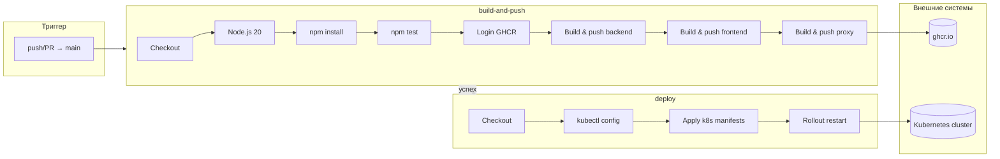

# Инфраструктура тестовой среды разработчика

## Аннотация

Курсовая работа посвящена созданию, настройке и администрированию инфраструктуры для автоматического развёртывания тестовых сред для разработчиков. Основная задача проекта — разработать клиент-серверное приложение и инфраструктурное окружение, обеспечивающие удобное развёртывание тестовых сред, совместимость с различными платформами (Docker, Docker Compose, Docker Swarm, Kubernetes) и автоматизацию доставки изменений (CI/CD).

В рамках работы представлены основные сведения о проекте: описание приложения, его функциональное назначение и инструменты, использованные для разработки клиентской и серверной частей, а также для контейнеризации и оркестрации. Проведённый анализ предметной области позволил определить ключевые требования к системе, что стало основой для проектирования архитектуры приложения и выбора технологического стека.

Итоги работы показывают, что предложенное решение позволяет эффективно разворачивать и администрировать тестовые среды с учётом особенностей предметной области. Разработанная система представляет собой удобную и масштабируемую платформу для автоматического развёртывания тестовых сред разработчиков.

---

**Состав:** backend (Node.js + Express), frontend (статический сайт), PostgreSQL, Redis, Nginx-прокси, pgAdmin (веб-интерфейс БД). Список API отображается на главной странице (блок «Документация API»). Манифесты K8s в `k8s/`, CI/CD в `.github/workflows/ci-cd.yml`.

---

## Соответствие теме: автоматическое развёртывание тестовой среды

Тема курсовой: **«Настройка и администрирование инфраструктуры для автоматического развёртывания тестовых сред для разработчиков»**. В проекте это реализовано следующим образом.

### Что считается «тестовой средой»

**Тестовая среда** — это готовое окружение, в котором запущено приложение (frontend, backend, БД, Redis и при необходимости прокси) и с которым разработчик может работать: открыть сайт, проверить API, убедиться, что изменения работают. В этом проекте такая среда описывается единым образом и может быть развёрнута тремя способами:

| Способ | Как «создаётся» среда | Роль автоматизации |
|--------|------------------------|---------------------|
| **Docker Compose** | Одна команда `docker compose up --build` поднимает все сервисы в одной сети. | Среда воспроизводится по файлу `docker-compose.yml` без ручной установки зависимостей. |
| **Docker Swarm** | `docker stack deploy` разворачивает тот же набор сервисов как stack в кластере. | Та же конфигурация, что и в Compose; образы собираются заранее, среда поднимается одной командой. |
| **Kubernetes** | Манифесты в `k8s/` описывают namespace, БД, Redis, backend, frontend, ingress. Применение манифестов создаёт или обновляет среду в кластере. | **Автоматическое развёртывание**: при каждом push в `main` срабатывает CI/CD (GitHub Actions), который собирает образы, пушит их в GHCR и применяет манифесты в кластер (или перезапускает deployment'ы). Разработчику не нужно вручную выполнять `kubectl apply` или пересобирать образы — среда обновляется сама. |

### Как система автоматически создаёт/обновляет среду

1. **По push в `main`** (или по merge PR в `main`): запускается workflow CI/CD.
2. **Сборка и проверка**: устанавливаются зависимости backend, запускаются тесты (`npm test`). При падении тестов конвейер останавливается, в кластер ничего не деплоится.
3. **Сборка образов**: собираются Docker-образы backend, frontend, proxy и отправляются в GitHub Container Registry (ghcr.io).
4. **Деплой в Kubernetes**: подставляется kubeconfig из секрета, выполняются `kubectl apply -f k8s/...` и `kubectl rollout restart` для backend и frontend. Кластер тянет образы с тегом `latest` и перезапускает поды.

В результате в кластере всегда развёрнута **актуальная тестовая среда**: последняя успешно протестированная версия приложения, доступная по URL (LoadBalancer или Ingress). Разработчик может сразу проверять изменения без ручного развёртывания.

### Настройка и администрирование

- **Настройка**: описание инфраструктуры в виде кода — `docker-compose.yml`, манифесты в `k8s/`, workflow в `.github/workflows/ci-cd.yml`. Изменения в коде и конфигурации попадают в репозиторий и через CI/CD применяются к среде.
- **Администрирование**: управление средой через Docker (Compose/Swarm) или Kubernetes (`kubectl`), просмотр логов, масштабирование, при необходимости — ручной запуск пайплайна или откат через образы/релизы.

Итог: в проекте реализована инфраструктура, которая по одному push в `main` автоматически прогоняет тесты, собирает образы и разворачивает (или обновляет) готовую тестовую среду в Kubernetes, что соответствует формулировке темы курсовой работы.

---

## Запуск

### Docker Compose (локально)

```bash
docker compose up --build
```

Сайт: **http://localhost** (статус, проверка backend, заметки, список API). **pgAdmin:** http://localhost:5050 (логин: `admin@localhost`, пароль: `admin`; хост БД: `db`, пользователь `devuser`, пароль `devpass`, БД `devdb`). После запуска контейнера подождите 1–2 минуты перед открытием. **Если интерфейс pgAdmin не открывается** — используйте **Adminer:** http://localhost:8080 (система: PostgreSQL, сервер: `db`, пользователь: `devuser`, пароль: `devpass`, БД: `devdb`).

### Docker Swarm

Образы при `stack deploy` не собираются — сначала соберите их.

```bash
docker compose build
docker swarm init
docker stack deploy -c docker-compose.yml dev-env
```

Проверка: `docker stack services dev-env`. Сайт: **http://localhost**.

При ошибке адреса: `docker swarm init --advertise-addr 127.0.0.1`.

Удаление: `docker stack rm dev-env`, затем `docker swarm leave --force`.

### Kubernetes

```bash
kubectl apply -f k8s/namespace.yaml
kubectl apply -f k8s/db-deployment.yaml
kubectl apply -f k8s/redis-deployment.yaml
kubectl apply -f k8s/backend-deployment.yaml
kubectl apply -f k8s/frontend-deployment.yaml
kubectl apply -f k8s/pgadmin-deployment.yaml
kubectl apply -f k8s/adminer-deployment.yaml
kubectl apply -f k8s/ingress.yaml
```

Доступ — через LoadBalancer/Ingress по вашей конфигурации кластера.

---

## Просмотр базы данных

БД не скрыта: к ней можно подключиться с теми же учётными данными, что и backend (**devuser** / **devpass**, база **devdb**). В приложении просто нет экрана «админки» для таблиц — это обычная изоляция по ролям (пользователь сайта не видит БД, а тот, у кого есть доступ к среде, может).

**Docker Compose** (порт 5432 наружу не проброшен — подключаемся из контейнера):

```bash
docker compose exec db psql -U devuser -d devdb -c "\dt"
```

Список таблиц: `\dt`. SQL: `SELECT * FROM ...` и т.д. Интерактивная консоль: `docker compose exec -it db psql -U devuser -d devdb`.

**Kubernetes** (под в том же namespace, что и backend):

```bash
kubectl exec -it deployment/backend -n dev-env -- sh
# внутри пода нет psql; либо поставить клиент, либо запустить временной под с postgres-образом:
kubectl run -it --rm psql-client --image=postgres:16-alpine -n dev-env --env="PGPASSWORD=devpass" -- psql -h db -U devuser -d devdb -c "\dt"
```

На хосте с установленным **psql** можно смотреть БД и через порт, если его пробросить. В `docker-compose.yml` у сервиса `db` портов на хост нет — при необходимости добавьте `ports: ["5432:5432"]` и подключайтесь: `psql -h localhost -U devuser -d devdb` (пароль: devpass).

---

## pgAdmin при развёртывании в облачном кластере Kubernetes

Есть два способа пользоваться pgAdmin, когда приложение уже в кластере (например, Yandex Cloud).

### Способ 1: pgAdmin в кластере (веб-интерфейс по отдельному адресу)

Разверните pgAdmin в том же namespace, что и БД:

```bash
kubectl apply -f k8s/pgadmin-deployment.yaml
```

Дождитесь появления внешнего IP у сервиса pgadmin:

```bash
kubectl get svc pgadmin -n dev-env
```

В колонке **EXTERNAL-IP** будет адрес (иногда он выставляется через 1–2 минуты). Откройте в браузере: **http://&lt;EXTERNAL-IP&gt;:5050**.

- **Вход в pgAdmin:** Email `admin@localhost`, пароль `admin`.
- **Добавить сервер PostgreSQL:** в pgAdmin — Add New Server. На вкладке **Connection**: Host — **`db`** (имя сервиса в кластере), Port — **5432**, Username — **devuser**, Password — **devpass**, Database — **devdb**. Сохранить.

Так как pgAdmin работает внутри кластера, он обращается к БД по внутреннему имени сервиса `db`. В облаке убедитесь, что в группе безопасности разрешён входящий трафик на порт 80 для сервиса pgAdmin (если используется отдельный LoadBalancer).

## Adminer при развёртывании в облачном кластере Kubernetes

Adminer — простой веб‑интерфейс для работы с PostgreSQL (легче, чем pgAdmin). В проекте он разворачивается в кластере как отдельный сервис `adminer` и публикуется через Service типа LoadBalancer на **порту 8080**.

### Доступ к Adminer

1. Примените манифест:

```bash
kubectl apply -f k8s/adminer-deployment.yaml
```

2. Узнайте внешний адрес:

```bash
kubectl get svc adminer -n dev-env
```

3. Откройте в браузере: **http://<EXTERNAL-IP>:8080**.

4. Параметры подключения на странице входа Adminer:
   - **Система**: PostgreSQL
   - **Сервер**: `db`
   - **Пользователь**: `devuser`
   - **Пароль**: `devpass`
   - **База данных**: `devdb`

Для доступа извне проверьте, что в security group/правилах балансировщика разрешён входящий TCP на порт **8080**.

### Способ 2: Локальный pgAdmin + туннель к БД в кластере

Не разворачивая pgAdmin в облаке, можно пробросить порт PostgreSQL на свой компьютер и подключиться из pgAdmin, установленного локально (или из контейнера Docker с pgAdmin на вашем ПК).

1. На машине, где настроен `kubectl` и доступ к кластеру, выполните:

```bash
kubectl port-forward svc/db -n dev-env 5433:5432
```

(Локальный порт **5433** используется, чтобы не конфликтовать с уже занятым 5432, например локальным PostgreSQL.) Оставьте команду работающей (туннель активен, пока процесс не завершён).

2. На этом же компьютере откройте pgAdmin (локально или в Docker). Добавьте сервер: **Host** — `localhost` (или `127.0.0.1`), **Port** — **5433**, **Username** — `devuser`, **Password** — `devpass`, **Database** — `devdb`.

3. Подключитесь — трафик идёт через туннель в кластер к сервису `db`.

Так можно пользоваться pgAdmin на своём ПК без публикации БД в интернет. Для CI/CD в workflow при необходимости можно добавить `kubectl apply -f k8s/pgadmin-deployment.yaml`, чтобы pgAdmin тоже разворачивался в кластере при деплое.

---

## CI/CD (GitHub Actions)

### Архитектура CI/CD

Конвейер состоит из двух последовательных job'ов на runner'ах GitHub (ubuntu-latest). Сборка и тесты выполняются первыми; деплой в Kubernetes — только при их успешном завершении.



| Этап | Где выполняется | Действие |
|------|-----------------|----------|
| **Триггер** | — | Запуск при `push` или `pull_request` в ветку `main`. |
| **build-and-push** | GitHub-hosted runner | Checkout кода → установка Node.js → `npm install` и `npm test` в backend → вход в GitHub Container Registry → сборка и пуш образов backend, frontend, proxy в `ghcr.io`. |
| **deploy** | GitHub-hosted runner | Восстановление kubeconfig из секрета `KUBE_CONFIG_B64` → применение манифестов из `k8s/` (namespace, db, redis, backend, frontend, ingress) → `kubectl rollout restart` для backend и frontend. |

Данные: код из репозитория; образы попадают в **GHCR**; кластер **Kubernetes** (например, Yandex Cloud) подтягивает образы по тегу `latest` после перезапуска deployment'ов.

---

Workflow **«CI/CD Dev Env»** запускается при push и PR в `main`.

- **Actions** → выбранный run → job **build-and-push**: шаг **Backend tests** — там вывод `npm test` (Jest). При падении тестов деплой не выполняется.
- Job **deploy** применяет манифесты в кластер и перезапускает backend/frontend (нужен секрет `KUBE_CONFIG_B64`).

### Секрет KUBE_CONFIG_B64

Для деплоя в K8s в репозитории нужен секрет **KUBE_CONFIG_B64** — base64 от kubeconfig.

**Кластер с exec (Yandex Cloud и т.п.):** на ПК с рабочим `kubectl` выполните `.\scripts\create-static-kubeconfig.ps1`, затем закодируйте `static-kubeconfig.yaml`:

```powershell
[Convert]::ToBase64String([System.Text.Encoding]::UTF8.GetBytes((Get-Content -Path ".\static-kubeconfig.yaml" -Raw)))
```

**Обычный kubeconfig (без exec):**

```powershell
[Convert]::ToBase64String([System.Text.Encoding]::UTF8.GetBytes((Get-Content -Path "$env:USERPROFILE\.kube\config" -Raw)))
```

Скопировать вывод → GitHub → Settings → Secrets and variables → Actions → New repository secret → Name: `KUBE_CONFIG_B64`, Value: вставленная строка.
